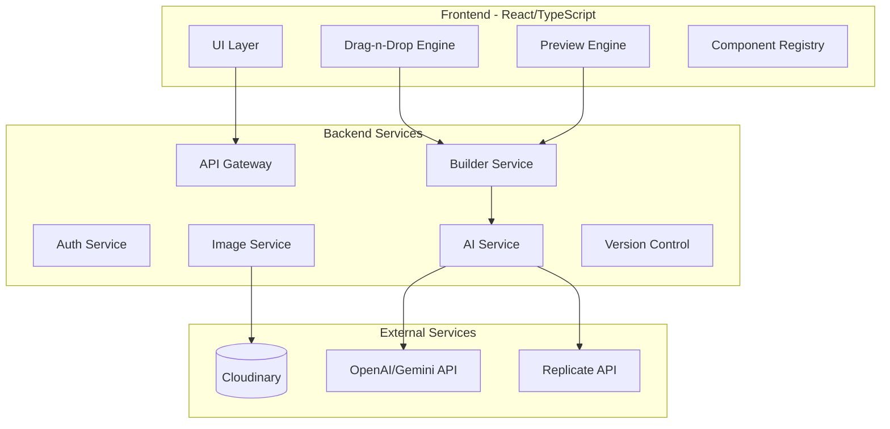
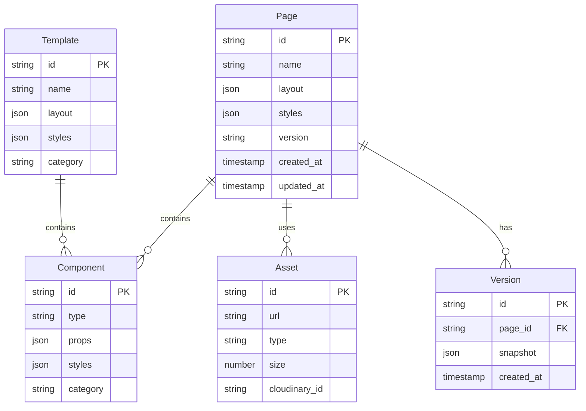
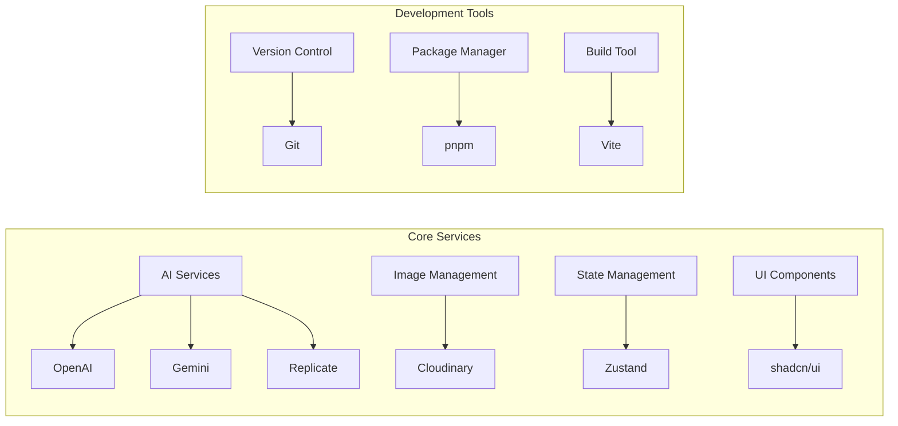
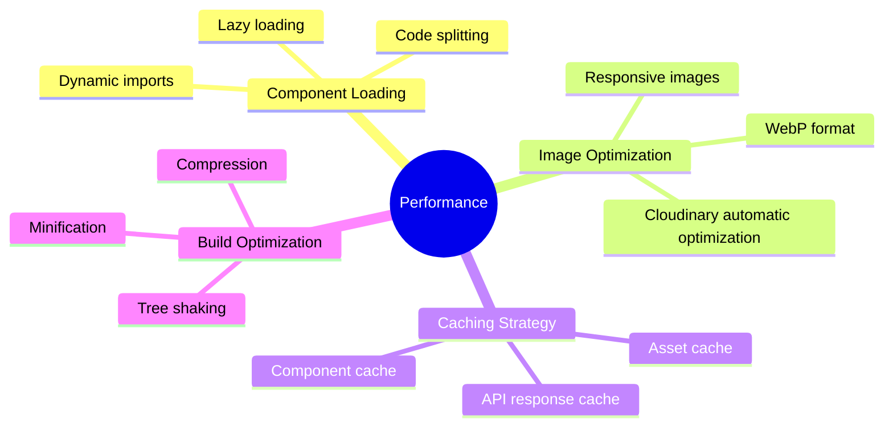

# Landing Page Builder System Architecture

## System Overview
This document outlines the technical architecture for an advanced landing page builder system built with React/TypeScript and shadcn/ui.

## System Architecture Diagram


## Data Model Design


## API Structure
```typescript
// Pages API
POST   /api/pages                 // Create new page
GET    /api/pages                 // List pages
GET    /api/pages/:id            // Get page
PUT    /api/pages/:id            // Update page
DELETE /api/pages/:id            // Delete page
POST   /api/pages/:id/clone      // Clone page
POST   /api/pages/:id/publish    // Publish page

// Components API
GET    /api/components           // List components
POST   /api/components           // Create custom component
PUT    /api/components/:id       // Update component
DELETE /api/components/:id       // Delete component

// Assets API
POST   /api/assets/upload        // Upload asset
GET    /api/assets               // List assets
DELETE /api/assets/:id           // Delete asset
POST   /api/assets/optimize      // Optimize asset

// AI API
POST   /api/ai/generate-content  // Generate content
POST   /api/ai/suggest-layout    // Get layout suggestions
POST   /api/ai/optimize-design   // Get design optimization

// Version Control
GET    /api/versions/:pageId     // List versions
POST   /api/versions/:pageId     // Create version
GET    /api/versions/:id/restore // Restore version
```

## Third-party Services


## Performance Optimization Strategies


## Key Technical Decisions

### Frontend Architecture
- React with TypeScript for type safety
- Zustand for state management
- Drag-and-drop using dnd-kit
- Modular component system with shadcn/ui
- Real-time preview using iframe isolation

### AI Integration
- Multi-model approach using OpenAI, Gemini, and Replicate
- AI service abstraction layer for model switching
- Caching of AI responses for similar requests
- Batch processing for layout optimization

### Image System
- Cloudinary for image storage and optimization
- Client-side image compression before upload
- Lazy loading with blur placeholders
- Automatic WebP conversion

### Version Control
- JSON-based diff system for layouts
- Incremental updates for better performance
- Snapshot system for quick rollbacks
- Branch-based template system