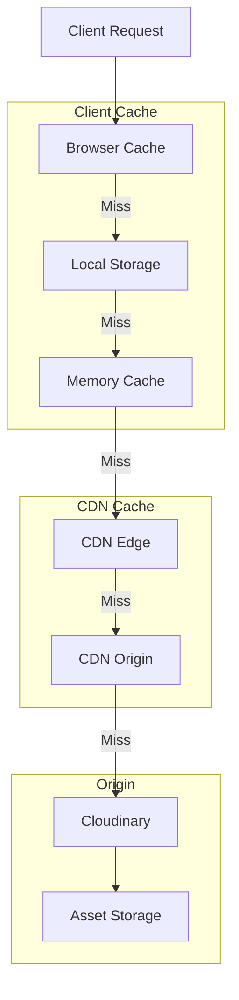
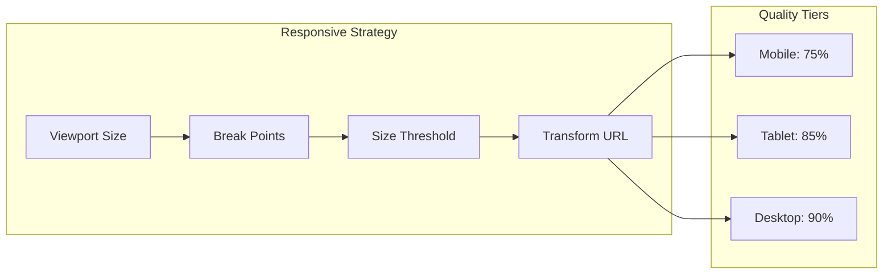

# Image Caching and Performance Strategy

## Cache Architecture



## Cache Tiers

### 1. Browser Cache
- **Policy**: Cache-Control with stale-while-revalidate
- **Duration**: 
  - Original images: 7 days
  - Transformed images: 30 days
  - Thumbnails: 90 days
- **Strategy**: ETag-based validation
- **Headers**:
  ```http
  Cache-Control: public, max-age=604800, stale-while-revalidate=86400
  ETag: "hash"
  Vary: Accept
  ```

### 2. Local Storage Cache
- **Scope**: Base64 placeholders and image metadata
- **Size Limit**: 5MB
- **Eviction**: LRU (Least Recently Used)
- **Structure**:
  ```typescript
  interface LocalStorageCache {
    placeholders: {
      [imageId: string]: {
        base64: string;
        timestamp: number;
        size: number;
      }
    };
    metadata: {
      [imageId: string]: ImageMetadata;
    }
  }
  ```

### 3. Memory Cache
- **Scope**: Frequently accessed images and computed values
- **Size Limit**: 100 items or 50MB
- **Eviction**: LRU with size and time constraints
- **Structure**:
  ```typescript
  interface MemoryCache {
    images: LRUCache<string, HTMLImageElement>;
    dimensions: LRUCache<string, ImageDimensions>;
    dominantColors: LRUCache<string, string>;
  }
  ```

### 4. CDN Cache
- **Provider**: Cloudinary + Custom CDN
- **TTL Settings**:
  - Original: 1 year
  - Transforms: 1 month
  - Dynamic: 1 hour
- **Invalidation**: Selective by transformation type

## Performance Optimizations

### 1. Resource Hints
```html
<!-- Preconnect to CDN -->
<link rel="preconnect" href="https://cdn.example.com">
<link rel="dns-prefetch" href="https://cdn.example.com">

<!-- Preload critical images -->
<link rel="preload" as="image" href="critical.webp">
```

### 2. Responsive Loading


### 3. Cache Management

```typescript
interface CacheManager {
  // Cache operations
  set(key: string, value: any, options: CacheOptions): Promise<void>;
  get(key: string): Promise<any>;
  delete(key: string): Promise<void>;
  clear(): Promise<void>;
  
  // Cache analysis
  getSize(): Promise<number>;
  getUsage(): Promise<CacheUsage>;
  
  // Cache maintenance
  prune(): Promise<void>;
  vacuum(): Promise<void>;
}

interface CacheOptions {
  ttl?: number;
  priority?: 'low' | 'normal' | 'high';
  group?: string;
  tags?: string[];
}

interface CacheUsage {
  totalSize: number;
  itemCount: number;
  hitRate: number;
  missRate: number;
}
```

## Monitoring

### 1. Performance Metrics
```typescript
interface PerformanceMetrics {
  // Timing metrics
  ttfb: number;           // Time to First Byte
  fcp: number;           // First Contentful Paint
  lcp: number;           // Largest Contentful Paint
  
  // Cache metrics
  cacheHits: number;
  cacheMisses: number;
  cacheSize: number;
  
  // Resource metrics
  bandwidth: number;
  transformationTime: number;
  loadTime: number;
}
```

### 2. Health Checks
- CDN availability monitoring
- Cache hit ratio alerts
- Storage capacity warnings
- Performance degradation detection

## Implementation Phases

### Phase 1: Basic Caching
1. Implement browser caching headers
2. Set up local storage for placeholders
3. Configure memory cache for frequent images

### Phase 2: Advanced Features
1. Add responsive loading strategies
2. Implement cache analysis tools
3. Set up monitoring and alerts

### Phase 3: Optimization
1. Fine-tune cache durations
2. Optimize eviction policies
3. Implement predictive loading

### Phase 4: Monitoring
1. Set up performance tracking
2. Implement health checks
3. Create monitoring dashboard

Would you like me to proceed with implementing any specific part of this caching strategy?