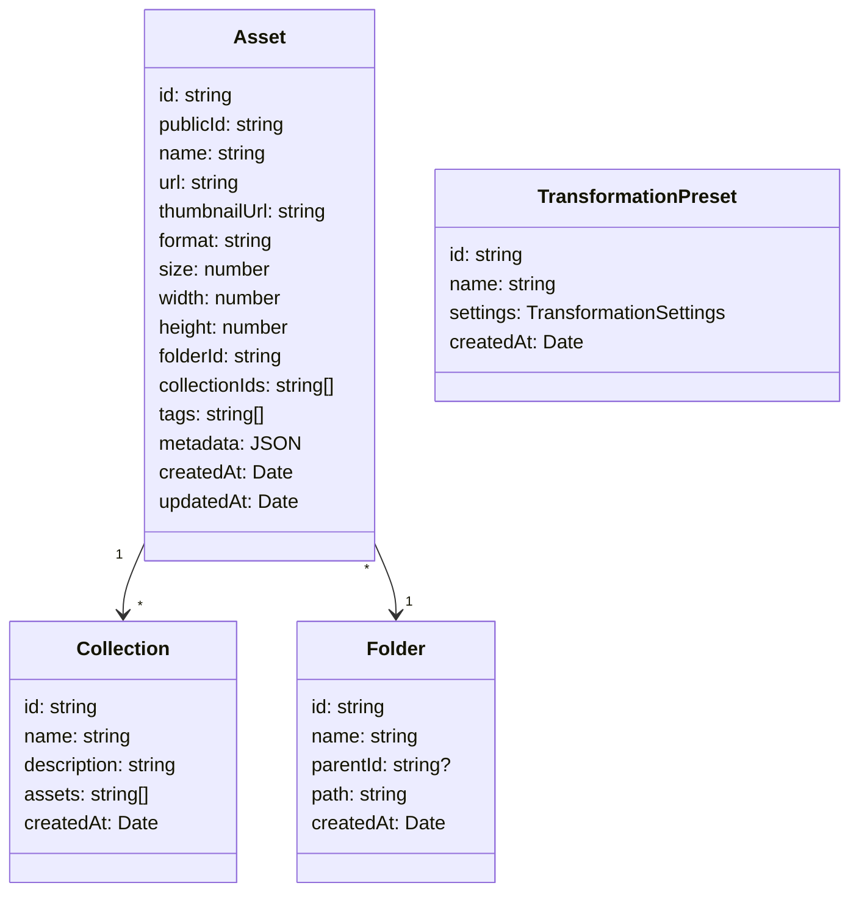
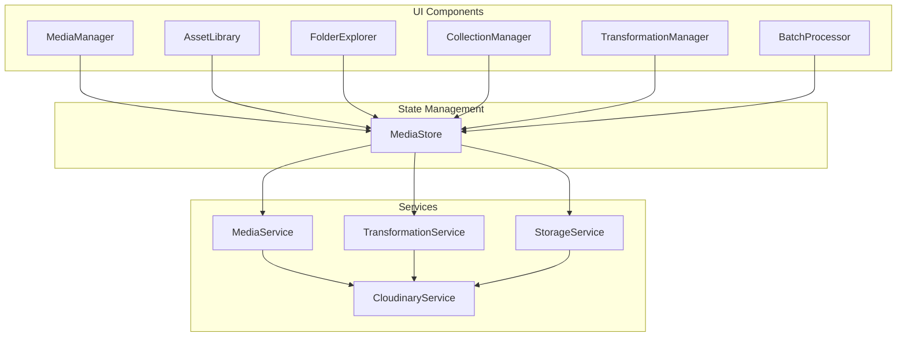
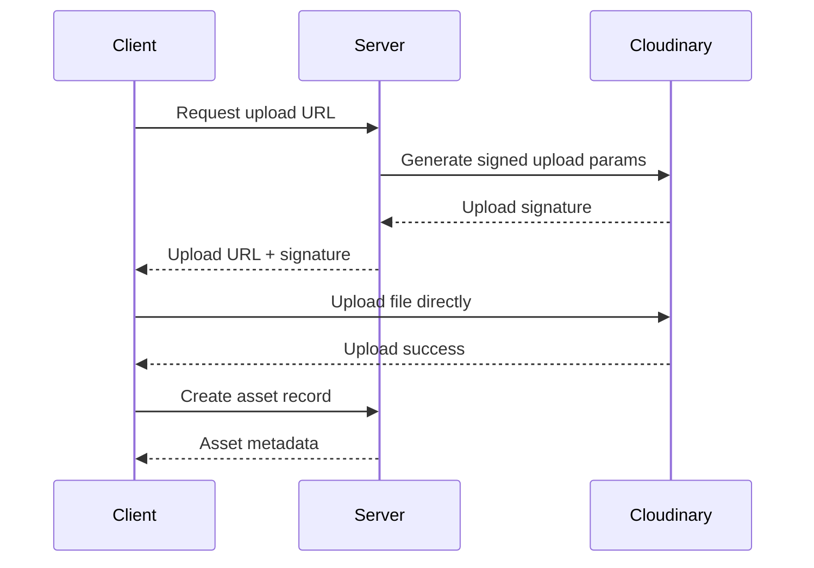
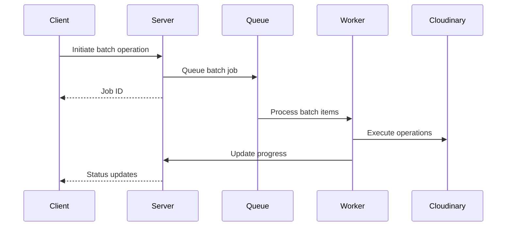

# Advanced Media Management System Architecture

## Extension Recommendations

1. [Draw.io Integration](https://marketplace.visualstudio.com/items?itemName=hediet.vscode-drawio) (`ext install hediet.vscode-drawio`) - Create and edit architecture diagrams
2. [PlantUML](https://marketplace.visualstudio.com/items?itemName=jebbs.plantuml) (`ext install jebbs.plantuml`) - Design sequence diagrams 
3. [Markdown Preview Mermaid Support](https://marketplace.visualstudio.com/items?itemName=bierner.markdown-mermaid) (`ext install bierner.markdown-mermaid`) - Preview Mermaid diagrams

## 1. Data Model

## 2. Component Architecture

## 3. API Endpoints

### Asset Management
- `POST /assets/upload` - Upload single asset
- `POST /assets/batch-upload` - Upload multiple assets
- `DELETE /assets/:id` - Delete asset
- `PUT /assets/:id` - Update asset metadata
- `GET /assets` - List assets with filtering
- `GET /assets/:id` - Get asset details

### Organization
- `POST /folders` - Create folder
- `GET /folders` - List folders
- `POST /collections` - Create collection
- `PUT /collections/:id` - Update collection

### Transformations
- `POST /transformations` - Apply transformation
- `POST /transformations/batch` - Batch transform
- `GET /transformations/presets` - List presets

## 4. Security & Access Control

- JWT-based authentication
- Role-based permissions:
  - Admin: Full access
  - Editor: Upload, transform, organize
  - Viewer: View and download only
- Signed upload URLs for secure direct-to-Cloudinary uploads
- Asset-level access control lists
- Rate limiting on API endpoints
- Comprehensive audit logging

## 5. Key Flows

### Asset Upload Flow

### Batch Processing Flow

## 6. Implementation Plan

### 1. Core Infrastructure
- Set up enhanced Cloudinary configuration
- Implement advanced error handling
- Add request/response logging

### 2. Data Layer
- Extend current ImageMetadata model
- Add new models for Folders and Collections
- Implement data validation

### 3. Service Layer
- Enhance CloudinaryService capabilities
- Add TransformationService
- Implement BatchProcessor

### 4. UI Components
- Build FolderExplorer
- Create CollectionManager
- Develop TransformationUI
- Add BatchOperationsUI

### 5. Security
- Implement RBAC
- Add request signing
- Set up audit logging

## 7. Additional Considerations

### Performance Optimization
- Implement lazy loading for asset lists
- Use WebP format by default
- Cache transformed assets
- Implement progressive image loading

### Error Handling
- Retry logic for failed operations
- Graceful degradation
- Detailed error reporting

### Monitoring
- Track usage metrics
- Monitor transformation costs
- Alert on quota usage

## 8. Future Extensions
- AI-powered asset tagging
- Advanced search capabilities
- Custom transformation workflows
- Integration with other storage providers