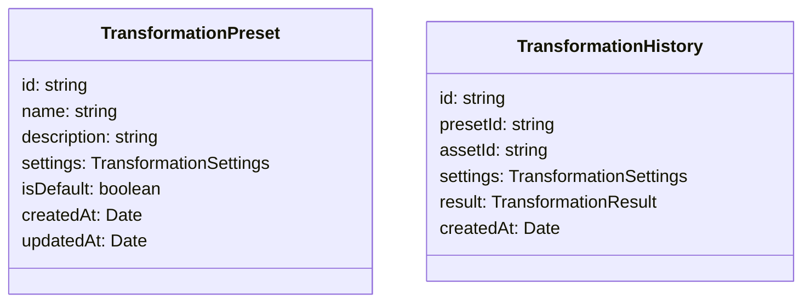
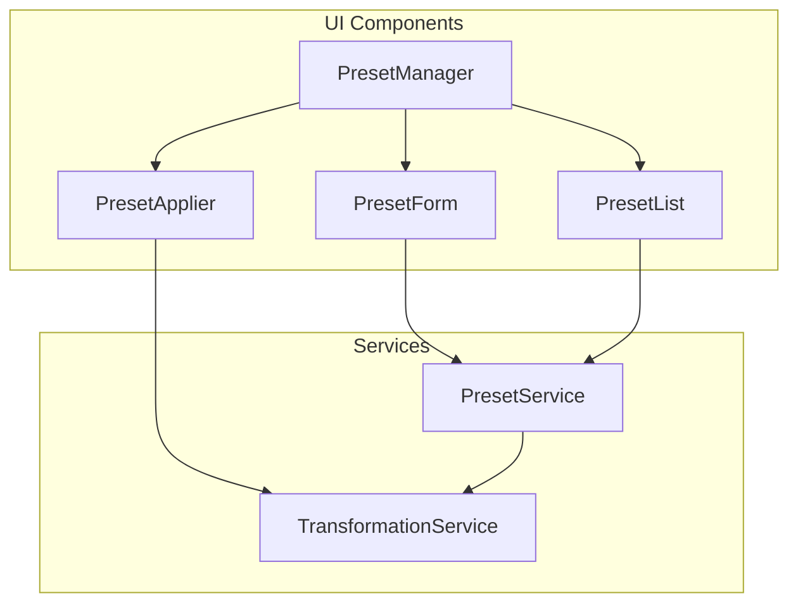
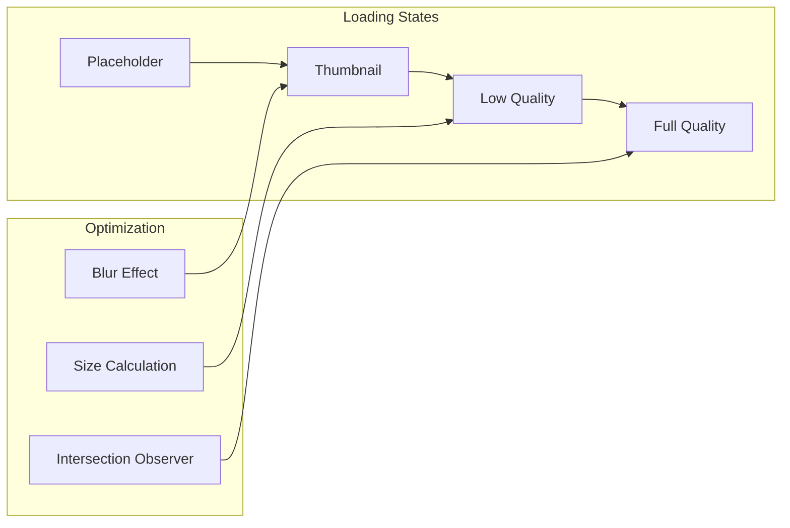
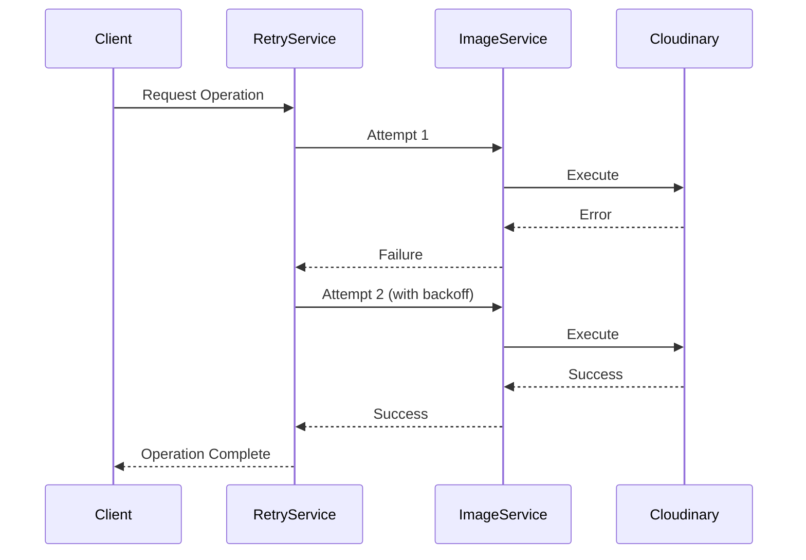
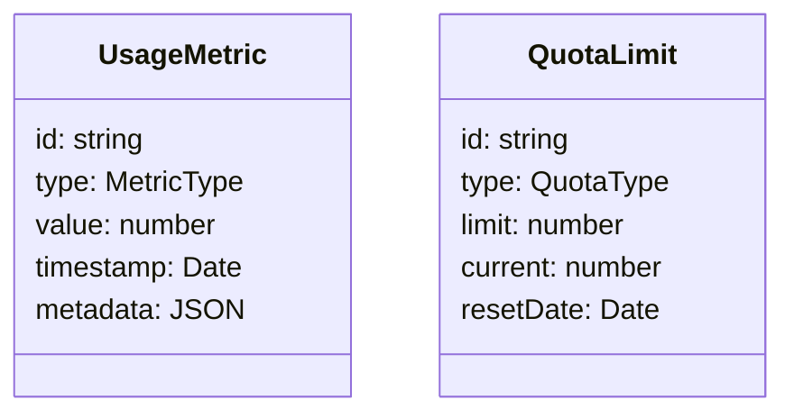
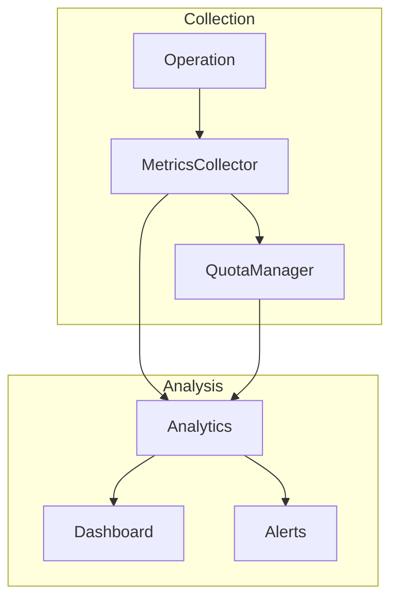

# Media Management System Enhancements

## 1. Transformation Presets

### Data Model

### Component Structure

## 2. Progressive Image Loading

### Implementation Strategy

### Components
- `ProgressiveImage`: Smart image component with loading states
- `ImageOptimizer`: Service for managing image loading strategies
- `LazyLoader`: Wrapper component for intersection observer logic

## 3. Retry Logic & Error Handling

### Retry Flow

### Components
- `RetryService`: Manages retry attempts with exponential backoff
- `ErrorBoundary`: React component for graceful degradation
- `ErrorLogger`: Service for tracking and reporting errors

## 4. Usage Metrics & Analytics

### Data Model

### Monitoring Flow

## Implementation Plan

### Phase 1: Transformation Presets
1. Create TransformationPreset model and database schema
2. Implement PresetService for CRUD operations
3. Build PresetManager UI components
4. Add preset selection to ImageEditor

### Phase 2: Progressive Loading
1. Create ProgressiveImage component
2. Implement blur placeholder technique
3. Add intersection observer for lazy loading
4. Update ImageLibrary to use ProgressiveImage

### Phase 3: Retry Logic
1. Implement RetryService with configurable strategies
2. Add retry logic to critical operations
3. Create ErrorBoundary components
4. Implement error logging and reporting

### Phase 4: Usage Metrics
1. Create metrics collection infrastructure
2. Implement QuotaManager service
3. Build analytics dashboard
4. Set up alerting system

## Technical Considerations

### Performance
- Use WebP format with fallbacks
- Implement staggered loading for large collections
- Cache transformed images
- Use worker threads for heavy operations

### Security
- Validate transformation settings
- Implement rate limiting
- Add quota enforcement
- Secure metrics endpoints

### Monitoring
- Track transformation times
- Monitor quota usage
- Log error rates
- Measure user engagement

Would you like me to proceed with implementing any specific part of this enhancement plan?