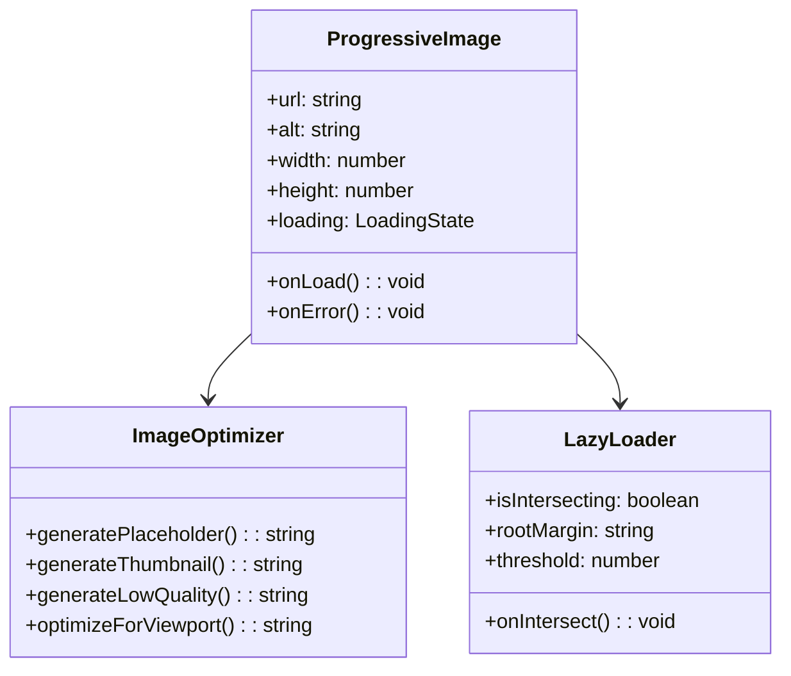
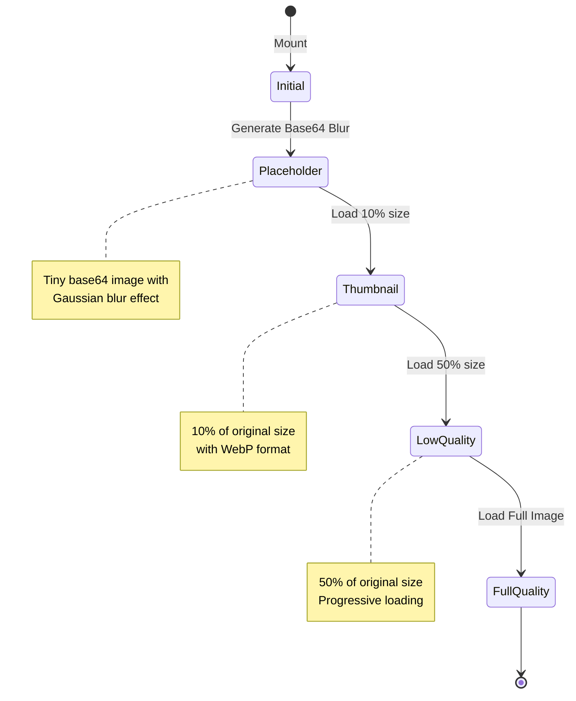
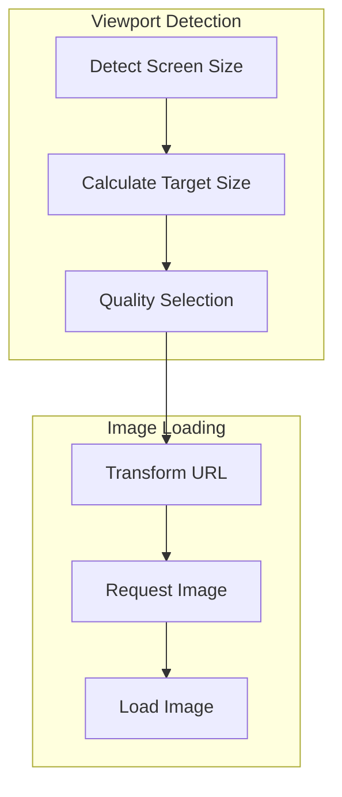

# Progressive Image Loading Implementation Plan

## Components Architecture



## Loading States Flow



## Implementation Details

### 1. ProgressiveImage Component
```typescript
interface ProgressiveImageProps {
  src: string;
  alt: string;
  width?: number;
  height?: number;
  priority?: boolean; // Skip progressive loading for above-the-fold images
  placeholder?: 'blur' | 'color' | 'none';
  className?: string;
  onLoad?: () => void;
  onError?: (error: Error) => void;
}
```

### 2. Loading Optimizations
1. **Placeholder Generation**
   - Generate tiny base64 image (4% of original)
   - Apply Gaussian blur
   - Use dominant color as fallback

2. **Thumbnail Generation**
   - 10% of original dimensions
   - WebP format
   - Quality: 30%
   - Blur up while loading

3. **Low Quality Image**
   - 50% of original dimensions
   - WebP format
   - Quality: 60%
   - Progressive JPEG fallback

4. **Full Quality Image**
   - Original dimensions or viewport-optimized
   - Preferred format (WebP with fallbacks)
   - Quality: 80-90%
   - Cache in browser and CDN

### 3. Intersection Observer Implementation
```typescript
interface LazyLoaderOptions {
  root?: HTMLElement;
  rootMargin?: string;
  threshold?: number;
  onIntersect: (entry: IntersectionObserverEntry) => void;
}
```

### 4. Advanced Features

#### Responsive Loading


#### Caching Strategy
- Browser cache with appropriate headers
- CDN caching for transformed images
- Local storage for base64 placeholders
- Memory cache for frequent images

#### Performance Metrics
- Time to first byte (TTFB)
- Blur placeholder load time
- Thumbnail load time
- Full image load time
- Memory usage

## Integration Steps

1. **Create Base Components**
   - ProgressiveImage component
   - ImageOptimizer service
   - LazyLoader utility

2. **Update Existing Components**
   - Modify ImageLibrary to use ProgressiveImage
   - Update ImageGrid for optimized loading
   - Add loading state indicators

3. **Add Cloudinary Integration**
   - Configure dynamic transformations
   - Set up automatic format selection
   - Implement responsive breakpoints

4. **Implement Caching**
   - Add browser caching
   - Configure CDN caching
   - Implement local storage cache

Would you like me to make any adjustments to this plan before we proceed with implementation?